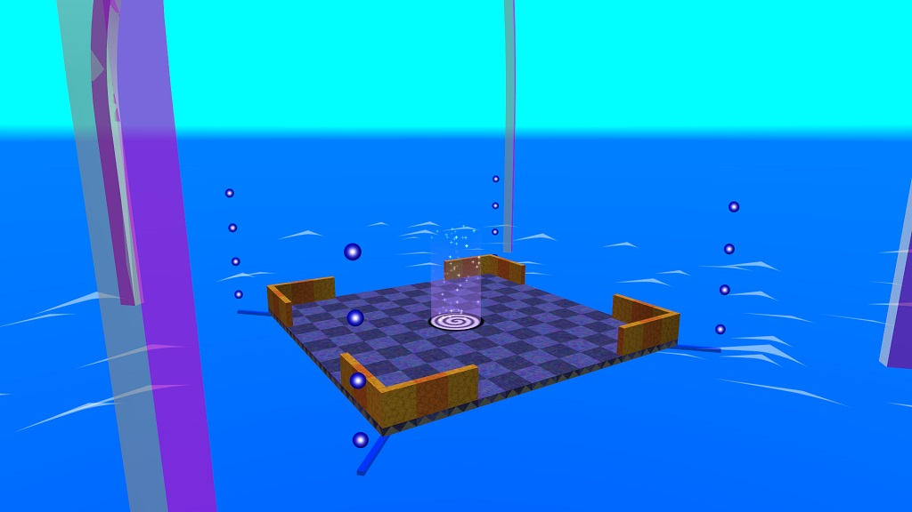

# Switchball static objects
These are static objects:

## Bridges
Connects for each intersections or in segments whatever you want.

## Intersections
These connectors are four way intersections and for corner wall.
If you don't want to connect them, you can just add the yellow rails on the edges.

This structure looks like this:

### Toggle and timer switch
If you have a switch, you must specify an gate, fence or bascule bridge.
If you want to make an timer switch, change the switch symbol to timer.

This structure looks like this:

### Teleporters
If you have a teleporter, you need specify an normal intersection
(not an special intersection and not a bridge and vehicles).

Target teleporters must be centered on the ground.
Models must be have an Pillar (such as violet).

This structure looks like this:

### Size changer
These are two size colors. One of the yellow is shrink and one of the blue is grow.

This structure looks like this:
