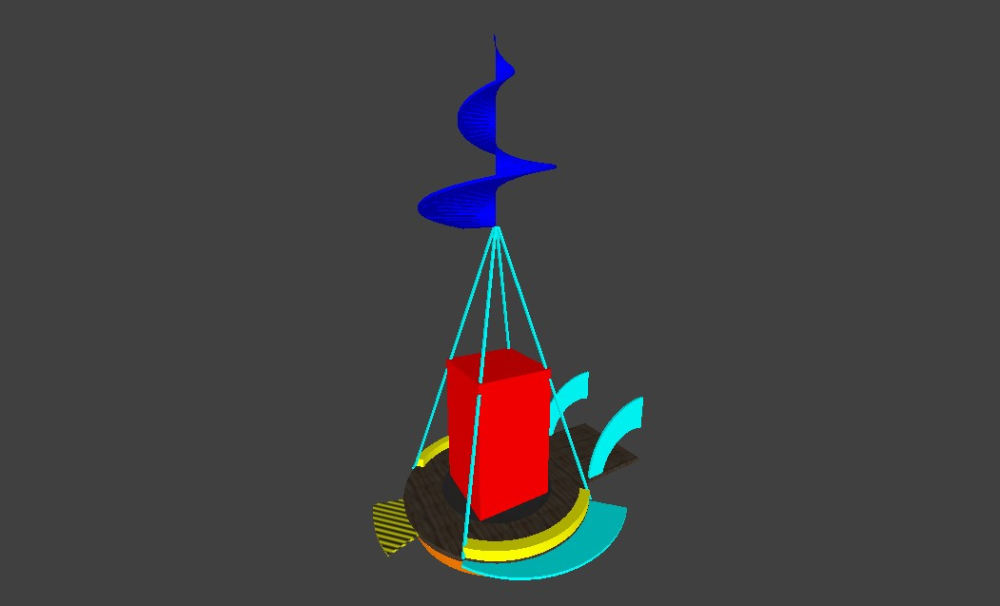

# Switchball essentials
These essential template pack contains large gyrocopter, just like the air transport, and checkpoints, which came from Switchball and Switchball HD:

You can place only one player start and goal per level, but placing outside the gyrocopter are not allowed.

It is not possible to start with any location except test mode. Each player start and goal requires airport gates.

## Main essentials

### Player start
Requirements:
- Air transport must be facing **NORTH** in the NetRadiant (with positive Y). See [original documentation](https://github.com/ersohnstyne/neverball-docs/blob/master/Entities.md#info_player_start), how to use design specifications.

Optional:
- Can also decorate more brushes on exteriors.

The player start decoration in the NetRadiant looks like this:

### Level exit
Requirements:
- Radius must be set to "0.38".
- Roof protection must installed to prevent leaving outside the gyrocopter after finished the level.
- An ending route line like a file "template-depart.map" must be connected to the intersection.

Optional:
- Can also decorate more brushes on exteriors.

The level exit decoration in the NetRadiant looks like this:

### Optional features
You can also rotate the level exit instead, but don't use start position, or start view angles .

## Checkpoints

*This entity features requires Pennyball 2.2.X and later with checkpoints.*

If you want to make the longest level or respawn from where you left off, you can install checkpoint rings.

To use the checkpoint, you need an small static platforms or wooden bridge, so the players can reach it.
