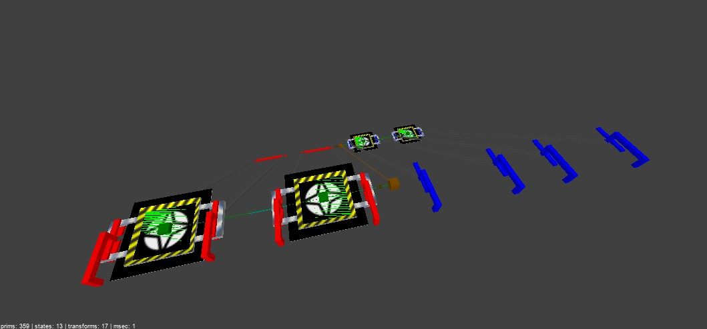

# Switchball simulated objects
These templates are simulated objects, which came from Switchball and Switchball HD:

## Locked Fence
Fence with locks must be placed on the bridge without rails.
If you want to add an timer, two first path corners is 0.1 seconds and idling is 4.8 seconds (eventually called 5 seconds).

If you want to allocate timer range in timed switch, **use with calculator**.

## Magnet transport
Transport can be placed for large travels.

To install transporters, you must place the rail with only straight.

The transport pattern in the game looks like this:

If you want to install double deck, elevators or escalators, more than one rails are required.

The escalators in the NetRadiant looks like this (top-side view, requires NB 1.7.0a):

**NOTE:** Maximum vertical speed is up to 15 km/h. If you use the large floors, 3 more rails is required that keeps horizontally, but polygon elevator floors such hollow are not allowed.

## Towers
Towers can be placed on static floors or large intersections for best decorations.

The decoration in the game looks like this:

