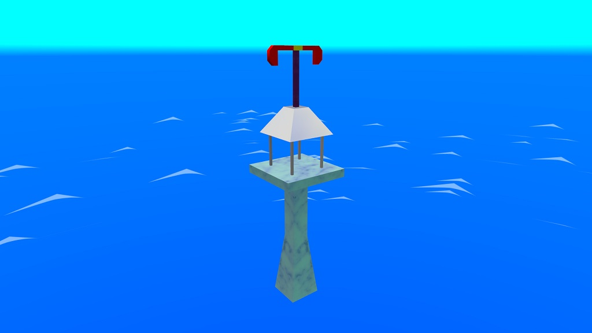
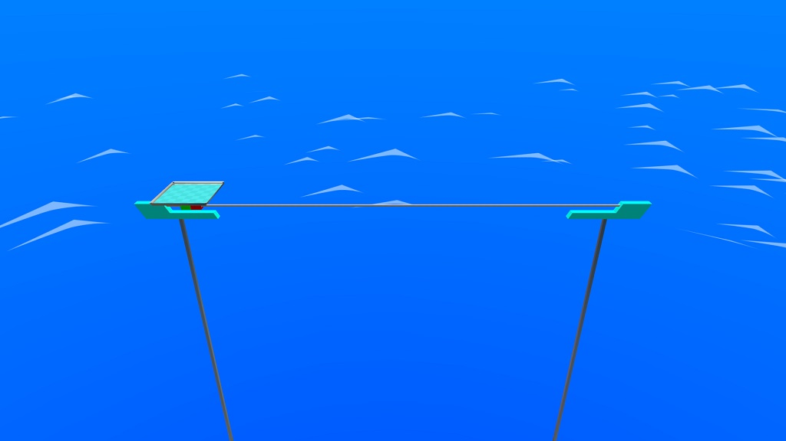

# Switchball simulated objects
These are simulated objects:

## Towers
Towers is great idea, but it must be placed on static floors or large intersections.

This tower looks like this:

## Magnet transport
Transport is impressive, but it must be placed only large intersections.

To install transporters, you must place only straight and never use some edges.

This transporters looks like this:

