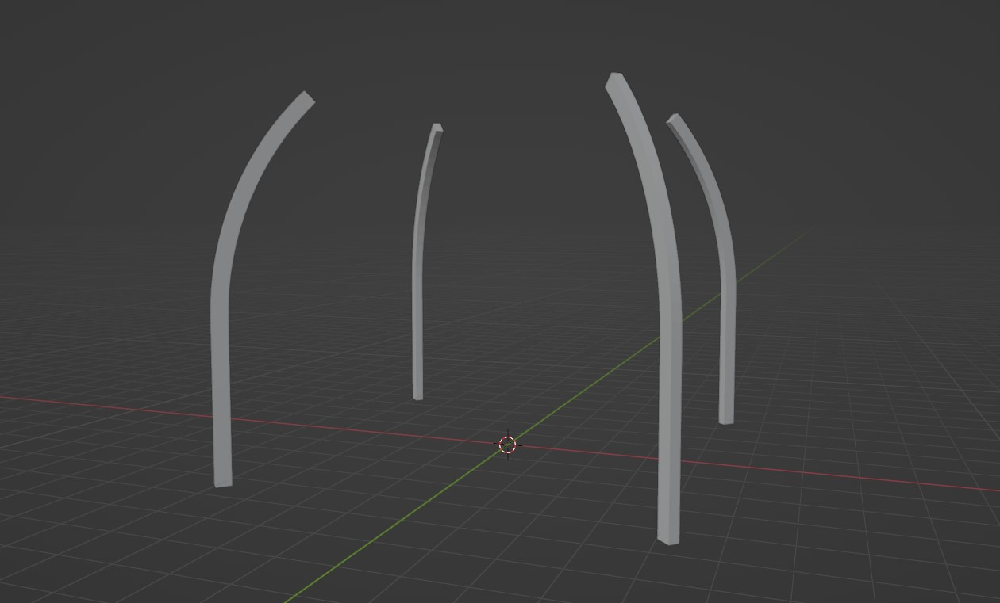
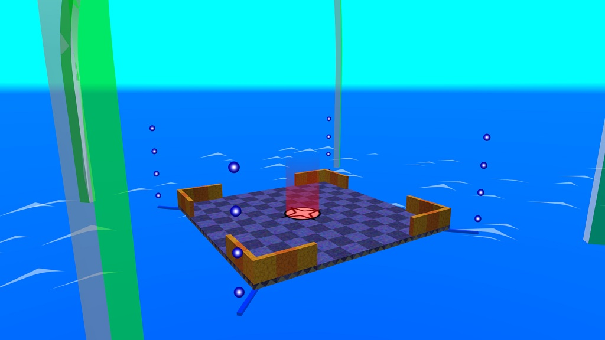
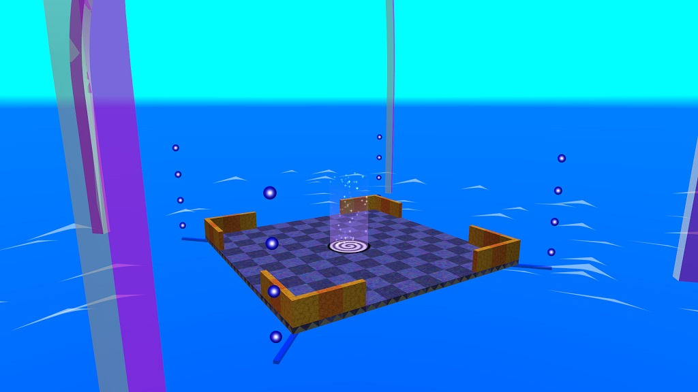
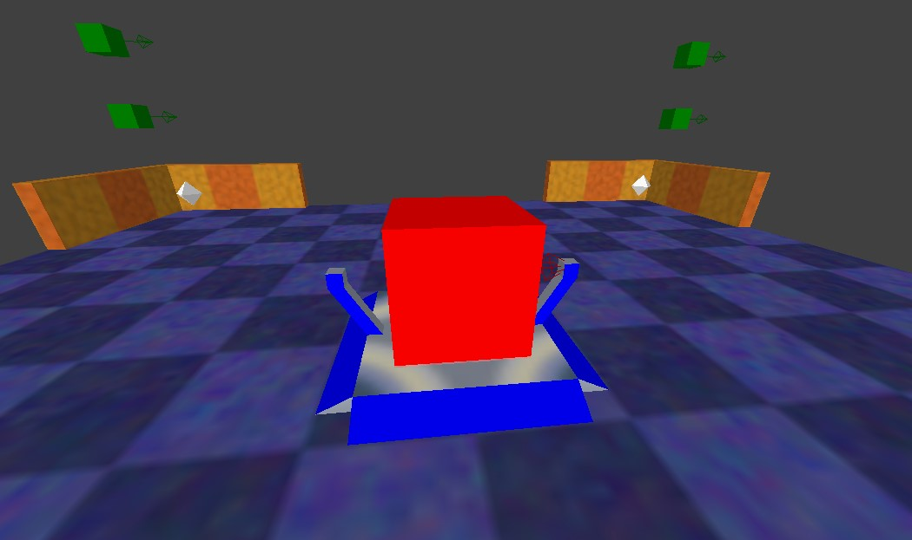

# Switchball static objects
These templates are static objects, which came from Switchball and Switchball HD:

## Bridges
Connects for each intersections or in segments whatever you want.

## Intersections
These connectors are four way intersections and for corner wall.
If you don't want to connect them, you can just add the yellow rails on the edges.

These model in this game looks like this:

### Electrical beams and items
If you'd create the coin size item or installing switch or teleporter beam, you need to obtain the **electrical pillars** that came from.

The brand new model in Blender looks like this:

#### Toggle and timer switch
If you have a switch, you must **specify an gate, fence or bascule bridge**.
If you have single or multiple device (which means path_corner), you must **connect the wires** for each other.
If you want to make an timer switch, **change the switch pad texture to timer**.

These switch in this game looks like this:

#### Teleporters
If you have a teleporter, you need **specify an normal intersection**
(not an special intersection and not a bridge and vehicles).

Target teleporters must be centered on the ground.

These teleport in this game looks like this:

#### Size changer
These are two size colors. One of the yellow is shrink and one of the blue is grow.

These morph with coin size in NetRadiant looks like this:

