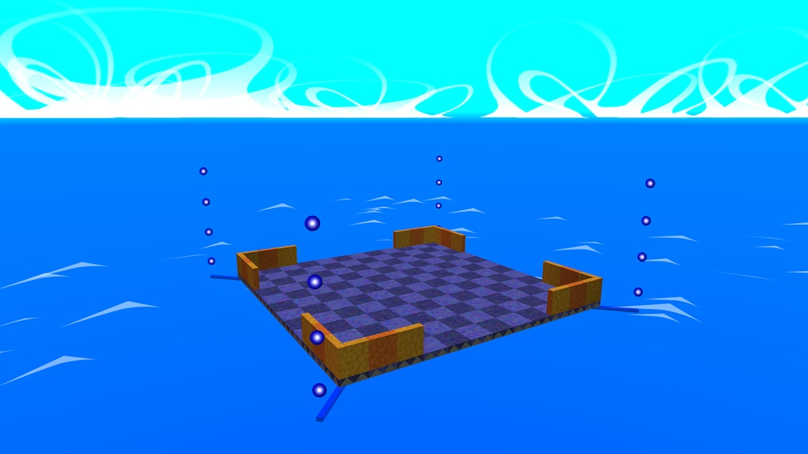

# Switchball static objects
These are static objects:

## Bridges
Connects for each intersections or in segments whatever you want.

## Intersections
These connectors are four way intersections and for corner wall.
If you don't want to connect them, you can just add the yellow rails on the edges.

The static model looks like this:

### Electrical beams and items
If you'd create the coin size item or installing switch or teleporter beam, you need to obtain the **electrical pillars** that came from.

The brand new model looks like this:

#### Toggle and timer switch
If you have a switch, you must **specify an gate, fence or bascule bridge**.
If you want to make an timer switch, change the switch pad texture to timer.

The electrical pattern looks like this:

#### Teleporters
If you have a teleporter, you need **specify an normal intersection**
(not an special intersection and not a bridge and vehicles).

Target teleporters must be centered on the ground.

The teleport pattern looks like this:

#### Size changer
These are two size colors. One of the yellow is shrink and one of the blue is grow.

The morph model pattern looks like this:

