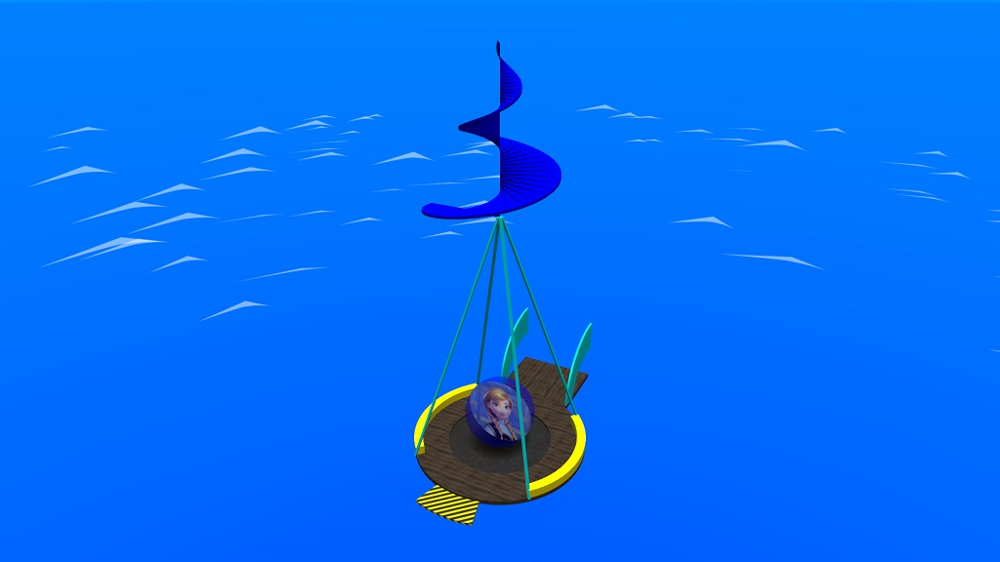

# Switchball vehicles
These vehicles is a gyrocopter. It contains only joined behind or in front of edges.
If you want to start with any location, you need to place over the normal intersection.

You can place only one start and end position per vehicles.

And the last things:
* Never place outside the gyrocopters with start and goal position!

### Start position
This is the start position.

To place this start position:
- An entity "info_player_start" must inside the vehicle.
- An vehicle must be facing **NORTH** (with positive Y).

This vehicle looks like this:

### End position
This is the end position.

To place this end position:
- An entity "info_player_deathmatch", radius must be set to "0.38".
- An vehicles and roof protection must be specified.
- An ending line like a file "template-depart.map" must be connected to the intersection.

### Optional features
You can also rotate the goal vehicle instead, but don't use start position, otherwise may not work for it.
